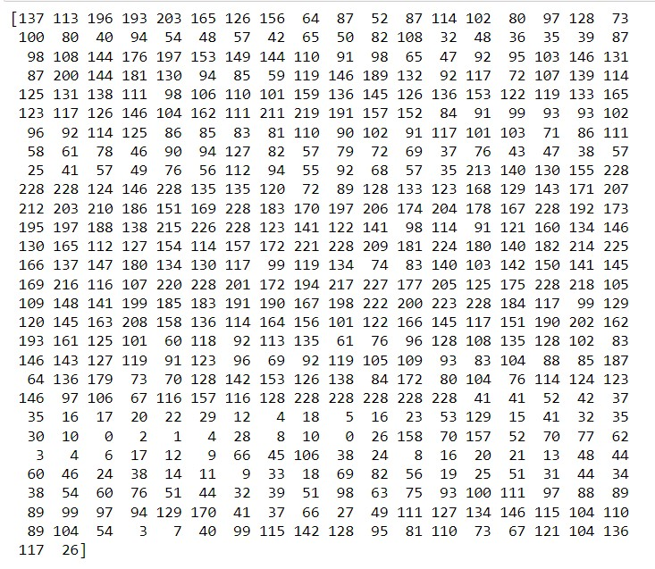

# Ex-07-Feature-Selection
# AIM:
To Perform the various feature selection techniques on a dataset and save the data to a file. 

# EXPLANATION:
Feature selection is to find the best set of features that allows one to build useful models.
Selecting the best features helps the model to perform well. 

# ALGORITHM:
### STEP 1:
Read the given Data.
### STEP 2:
Clean the Data Set using Data Cleaning Process.
### STEP 3:
Apply Feature selection techniques to all the features of the data set.
### STEP 4:
Save the data to the file.


# CODE:

```python
from sklearn.datasets import load_boston
import pandas as pd
import numpy as np
import matplotlib
import matplotlib.pyplot as plt
import seaborn as sns
import statsmodels.api as sm
%matplotlib inline
from sklearn.model_selection import train_test_split
from sklearn.linear_model import LinearRegression
from sklearn.feature_selection import RFE
from sklearn.linear_model import RidgeCV, LassoCV, Ridge, Lasso

from sklearn.datasets import load_boston
boston = load_boston()

print(boston['DESCR'])

import pandas as pd
df = pd.DataFrame(boston['data'] )
df.head()

df.columns = boston['feature_names']
df.head()

df['PRICE']= boston['target']
df.head()

df.info()

plt.figure(figsize=(10, 8))
sns.distplot(df['PRICE'], rug=True)
plt.show()

X=df.drop("PRICE",1)
y=df["PRICE"]

from sklearn.feature_selection import SelectKBest, chi2
X, y = load_boston(return_X_y=True)
X.shape

from sklearn.feature_selection import VarianceThreshold
selector = VarianceThreshold()
selector.fit_transform(X)

from sklearn.feature_selection import mutual_info_regression
mi = mutual_info_regression(X, y);
mi = pd.Series(mi)
mi.sort_values(ascending=False)
mi.sort_values(ascending=False).plot.bar(figsize=(10, 4))

from sklearn.feature_selection import f_classif
from sklearn.feature_selection import SelectKBest,SelectPercentile
skb = SelectKBest(score_func=f_classif, k=2) 
X_data_new = skb.fit_transform(X, y)
print('Number of features before feature selection: {}'.format(X.shape[1]))
print('Number of features after feature selection: {}'.format(X_data_new.shape[1]))

cor=df.corr()
sns.heatmap(cor,annot=True)

mad=np.sum(np.abs(X-np.mean(X,axis=0)),axis=0)/X.shape[0]
plt.bar(np.arange(X.shape[1]),mad,color='black')

from sklearn import preprocessing
lab = preprocessing.LabelEncoder()
y_transformed = lab.fit_transform(y)
print(y_transformed)

X = X.astype(int)
chi2_selector = SelectKBest(chi2, k=2)
X_kbest = chi2_selector.fit_transform(X, y_transformed)
print('Original number of features:', X.shape[1])
print('Reduced number of features:', X_kbest.shape[1])

X_new = SelectPercentile(chi2, percentile=10).fit_transform(X, y_transformed)
X_new.shape

pip install mlxtend

from mlxtend.feature_selection import SequentialFeatureSelector as SFS
from sklearn.linear_model import LinearRegression
sfs = SFS(LinearRegression(),
          k_features=10,
          forward=True,
          floating=False,
          scoring = 'r2',
          cv = 0)
sfs.fit(X, y)
sfs.k_feature_names_

sbs = SFS(LinearRegression(),
         k_features=10,
         forward=False,
         floating=False,
         cv=0)
sbs.fit(X, y)
sbs.k_feature_names_

sffs = SFS(LinearRegression(),
         k_features=(3,7),
         forward=True,
         floating=True,
         cv=0)
sffs.fit(X, y)
sffs.k_feature_names_

from sklearn.feature_selection import RFE
lr=LinearRegression()
rfe=RFE(lr,n_features_to_select=7)
rfe.fit(X, y)
print(X.shape, y.shape)
rfe.transform(X)
rfe.get_params(deep=True)
rfe.support_
rfe.ranking_

from sklearn.ensemble import RandomForestClassifier
model = RandomForestClassifier().fit(X,y_transformed)
importances=model.feature_importances_

final_df=pd.DataFrame({"Features":pd.DataFrame(X).columns,"Importances":importances})
final_df.set_index("Importances")
final_df=final_df.sort_values("Importances")
final_df.plot.bar(color="green")
```
# OUTPUT:





# RESULT:
Thus various feature selection techniques are applied to the given data set .
